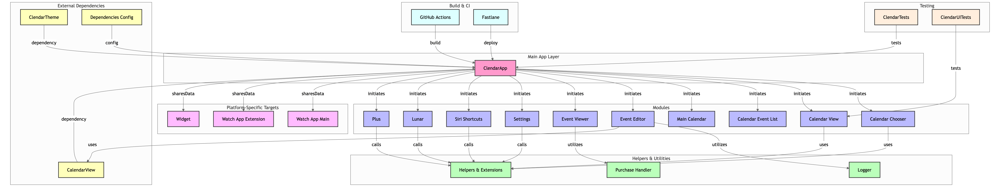

[](https://github.com/vinhnx/Clendar/actions/workflows/swiftlint.yml)
[](https://deepwiki.com/vinhnx/Clendar)

---

*Update 9/4/2026*:

Hi everyone, after careful consideration and seeing Clendar still be loved and starred on GitHub. I think it should keep maintaining and improving, and it's ready for a new maintainer. If you're interested in taking development and steering Clendar with the latest iOS, SwiftUI, and Concurrency updates since I last updated it. Feel free to message me at @vinhnx on X (formerly known as Twitter) or email me at vinhnguyen2308 [at] gmail [dot] com. Currently, if you follow me on GitHub, my interests are currently building [VT Code](https://github.com/vinhnx/vtcode), a semantic coding harness, and I'm very excited about it. Seeing Clendar still being loved, I would not be able to let it be “abandoned” like this, since my time and energy at the moment have been shifted. I'm looking forward to hearing from any developer and maintainer who would like to take Clendar further.

Thank you and best regards, 
Vinh Nguyen

---

Hi everyone,

I wanted to provide an update regarding the Clendar app. Due to some personal matters, I haven't been able to dedicate much time to maintaining the app recently.

I'm truly grateful for all the support and contributions from the Open Source community over the past years. Your encouragement and assistance have meant a lot to me and motivated me to continually improve the app. Unfortunately, I've had to step back temporarily to address some personal matters.

[This app started out as just my personal project to catch up with annual WWDC changes](https://github.com/vinhnx/Clendar?tab=readme-ov-file#about), and one day I decided to convert the whole app from Swift & UIKit to SwiftUI.

The rest is history, and the stars keep rising 🌟❤️.

Words simply cannot describe how grateful I am for all your [contributions and warm messages](https://github.com/vinhnx/Clendar/issues). I'm touched that everyone [loves](https://github.com/vinhnx/Clendar/stargazers) this small app and project as much as I do.

Clendar will always be in my heart.

Thank you for your understanding and patience. I look forward to resuming work on Clendar and continuing to engage with this fantastic community.

Best regards,

Vinh Nguyen

---

<h1 align="center">
Clendar - Minimal Calendar
</h1>
<p align="center">Minimal Calendar & Widget</p>

<p align="center"></p>

<p align="center"><a href="https://apps.apple.com/app/clendar-a-calendar-app/id1548102041#?platform=iphone"
                style="display: inline-block; overflow: hidden; border-top-left-radius: 13px; border-top-right-radius: 13px; border-bottom-right-radius: 13px; border-bottom-left-radius: 13px; width: 250px; height: 83px;"></a></p>

> [Landing Page](http://vinhnx.github.io/clendar-site)

### Architecture

<p align="center">
  
</p>

<p align="center">
  <em>* Diagram generated by <a href="https://github.com/ahmedkhaleel2004/gitdiagram">gitdiagram</em>
</p>

### Table of Contents

- 📋 [About](#about)
- 🚀 [What's Clendar](#whats-clendar)
- 📦 [SwiftUI](#swiftui)
- 💻 [Tip to build on M1 Macs](#tip-to-build-on-m1-macs)
- 📚 [Tech stacks](#tech-stacks)
- 📖 [Requirements](#requirements)
- 💖 [My own Swift Packages currently used in Clendar](#my-own-swift-packages-currently-used-in-clendar)
- 📝 [Contributing](#contributing)
- 📂 [Important Files To Look At](#important-files-to-look-at)
- 🙌 [Contributors](#contributors)
- ⚖️ [License](#license)
- 🏆 [Open-source inspiration](#open-source-inspiration)
  
### About

This project started out as a UIKit-based app for me to learn new WWDC features over the years. But one day, I decided to convert the whole app from UIKit to SwiftUI and boom, here we are.

This is the PR => [https://github.com/vinhnx/Clendar/pull/35](https://github.com/vinhnx/Clendar/pull/35)

### What's 'Clendar'?

It's just Calendar, without an 'a'. I thought it was unique, but it turns out it's not going well with ASO (App Store Optimization) and SEO (Search Engine Optimization).

Clendar is a calendar app made simpler. The application includes features like widgets, themes, keyboard shortcuts, and natural language parsing.

Its main features include:

- Widgets, with customizable dark/light themes
- Keyboard shortcuts
- Siri shortcuts
- Apple Watch complications
- Custom app icons
- Natural language parsing
- Lunar day view
- Dark and light modes built-in
- Accessibility support
- Localizations support

### SwiftUI

📖 I believe the best way to learn is by doing. [SwiftUI](https://developer.apple.com/xcode/swiftui/) is evolving and I think it's the future of writing apps.

> SwiftUI is an innovative, exceptionally simple way to build user interfaces across all Apple platforms with the power of Swift. Build user interfaces for any Apple device using just one set of tools and APIs.
>
> -- Apple

The true power of SwiftUI, to me, is its flexibility, thanks to its vast realm of view modifiers and expressiveness with property wrappers.

You can create a "Hello, World!" app with just a few lines of code (check out the new [@main](https://developer.apple.com/documentation/swiftui/app/main()) attribute!) or even, [a calendar view](https://gist.github.com/mecid/f8859ea4bdbd02cf5d440d58e936faec).

SwiftUI gives you the most flexible tool an Apple developer could ever ask for, all you need is a bit of creativity, and the [possibilities](https://github.com/Juanpe/About-SwiftUI), [are](https://github.com/chinsyo/awesome-swiftui), [limitless](https://github.com/onmyway133/awesome-swiftui).

Clendar would not be possible without the public knowledge of the community. To name a few, in no particular order:

- [swiftwithmajid.com](https://swiftwithmajid.com)
- [raywenderlich.com](https://raywenderlich.com)
- [swiftbysundell.com](https://www.swiftbysundell.com)
- [hackingwithswift.com](https://www.hackingwithswift.com)
- [sarunw.com](https://sarunw.com)
- [onmyway133/blog/issues](https://github.com/onmyway133/blog/issues)
- [swiftui](https://github.com/topics/swiftui)

My notes about SwiftUI:

- [notes/issues](https://github.com/vinhnx/notes/issues?q=is%3Aissue+is%3Aopen+swiftui+label%3ASwiftUI)
- [notes/issues/342](https://github.com/vinhnx/notes/issues/342)

By publishing Clendar, I would like to give back to the community. 😊

### Tip to build on M1 Macs

> So, maybe someone, who wants to contribute to this repo will find the next info very helpful.
> If you have a MacBook on M1:
>
> ```bash
> sudo arch -x86_64 gem install ffi
> arch -x86_64 pod install
> ```
> Or:
>
> run terminal with Rosetta and run `pod install`
>> Thanks [https://github.com/vinhnx/Clendar/issues/220#issuecomment-1107809043](https://github.com/vinhnx/Clendar/issues/220#issuecomment-1107809043)

### Tech stacks

The following technologies were used to develop our application:

Core:

- [SwiftUI](https://developer.apple.com/xcode/swiftui/) (and UIKit interoperability)
- iPadOS
- [WidgetKit](https://developer.apple.com/documentation/widgetkit)
- [SiriKit](https://developer.apple.com/documentation/sirikit/)
- EventKit/EvenKit UI - wrapper with my own [Shift package](https://github.com/vinhnx/Shift) 📆
- [WatchKit](https://developer.apple.com/documentation/watchkit/)
- Combine
- Catalyst
- [StoreKit](https://developer.apple.com/documentation/storekit)

Build delivery tool:

- [Fastlane](https://fastlane.tools/)

Package Managers:

- [Swift Package Manager](https://www.swift.org/package-manager/)
- [CocoaPods](https://cocoapods.org/)

Linter:

- [SwiftLint](https://swiftpackageindex.com/realm/SwiftLint)

Formatter:

- [SwiftFormat](https://formulae.brew.sh/cask/swiftformat-for-xcode)

Action:

- [SwiftLint is integrated on GitHub Action workflow](https://github.com/vinhnx/Clendar/actions?query=workflow%3ASwiftLint) 🚀

### Requirements

(for async/await):

- Xcode 13.1
- iOS 15.0
- watchOS 8.0
- Ruby (for Fastlane build automation)

### My own Swift Packages currently used in Clendar

- [Shift](https://github.com/vinhnx/Shift) - Result-based wrapper for EventKit. SwiftUI supported!
- [Laden](https://github.com/vinhnx/Laden) - SwiftUI loading indicator view

### Contributing

Contributing is more than welcome. If you feel like helping the app or want to add new features, feel free to take a look at my [issues page](https://github.com/vinhnx/Clendar/issues). Thanks!

How To Contribute:

- Report issues you're facing
- Give a 👍 on issues that are relevant to you
- Answer queries on the issue tracker

If you don't know where to start:

- Navigate to the [issues page](https://github.com/vinhnx/Clendar/issues)
- Filter by label
- Look for issues related to [good first issue](https://github.com/vinhnx/Clendar/issues?q=is%3Aopen+is%3Aissue+label%3A%22good+first+issue%22)
- Feel free to look at all the issues opened and pick one that interests you!

1. Fork the project repository by clicking Fork in the top right-hand corner 🍴
2. Clone the repository onto your local machine using the Git URL 💻
3. Switch to the branch you want to work on and start contributing! 📝 

When submitting an issue, please make sure your description is clear and has enough information for someone to be able to reproduce the issue!

### Important Files To Look At

- [Clendar](https://github.com/vinhnx/Clendar/tree/main/Clendar)
  - Clendar application program
- [ClendarTests](https://github.com/vinhnx/Clendar/tree/main/ClendarTests)
  - Contents to test the Clendar program on iOS software
- [ClendarUITests](https://github.com/vinhnx/Clendar/tree/main/ClendarUITests)
  - Contents to test the Clendar UI on iOS software
- [ClendarWatchApp Extension](https://github.com/vinhnx/Clendar/tree/main/ClendarWatchApp%20Extension)
  - Contents used to create Clendar compatibility to watchOS using SwiftUI
- [Packages](https://github.com/vinhnx/Clendar/tree/main/Packages)
  - Contains Clendar theme and SwiftUI calendar view

### Contributors

Huge thanks to everyone who took their precious time and effort to contribute to the project:

- [Aleksandr Sutulov](https://github.com/AlexanderSutul)
- [Jan Matoniak](https://github.com/kapucnov2321)
- [Prabaljit Walia](https://github.com/prabal4546)
- [Gaurav Kakkar](https://github.com/shadowfax90)
- [Andrey Bozhko](https://github.com/AndreyBozhko)
- [carboitel](https://github.com/carboitel)
- [Michele Zenoni](https://github.com/Levyathanus)
- [Samis](https://github.com/samis0707)
- 💡 [your name here?...](https://github.com/vinhnx/Clendar/issues) 

Words simply cannot describe how thankful I am. I'm deeply appreciative of all your kind contributions. 

I feel very lucky that my small side project helps people find inspiration 💙

Thank you again, you rock!

🇺🇳 🚀

### License

[MIT License](https://github.com/vinhnx/Clendar/blob/main/LICENSE)

You can do whatever you want with this source code: modify, tweak, or use it as learning resources, for example... 🛠👨🏻‍💻👩🏻‍💻

But, please don't re-distribute the app on the App Store with a different name. 🥺

And, if you like, you can download the app for free on the [App Store](https://apps.apple.com/us/app/clendar-a-calendar-app/id1548102041?itsct=apps_box&itscg=30200).

### Open-source inspiration

- [Hackers is an elegant iOS app for reading Hacker News written in Swift.](https://github.com/weiran/Hackers)
- [jeffreybergier](https://github.com/jeffreybergier)

---

## Star History

[](https://star-history.com/#vinhnx/Clendar&Date)

---

Thanks and take care! 🍀

I'm `@vinhnx` on almost everywhere.
